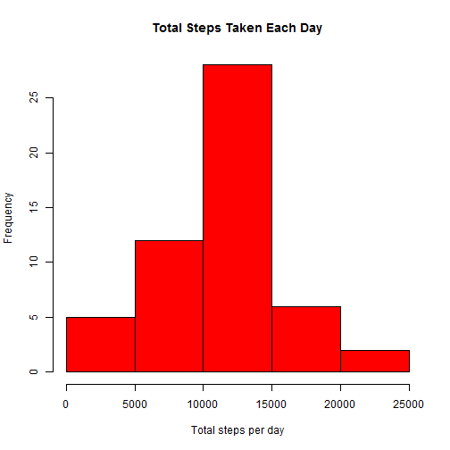
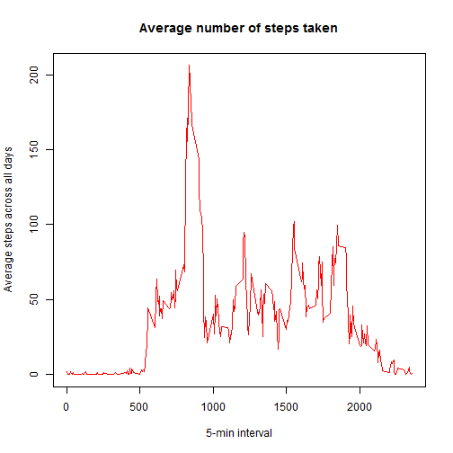
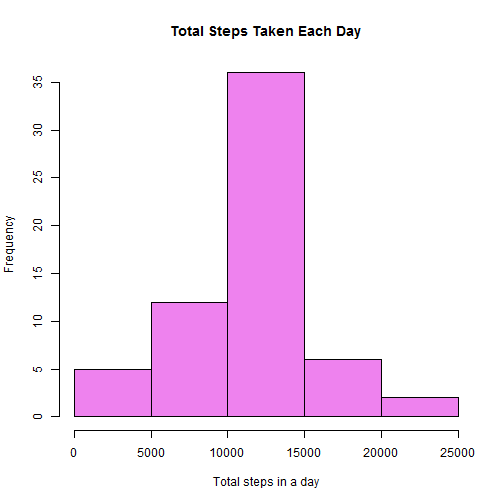
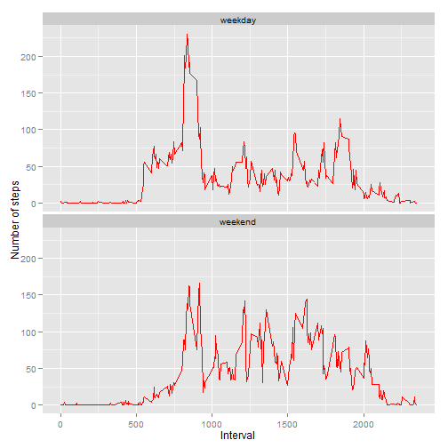

<<<<<<< HEAD
# "Reproducible Research Peer Assessment 1"
*Coursera March 2015*

## Loading and preprocessing the data


```r
#Load required libraries
library(knitr)
library(data.table)
library(ggplot2)

#Load the data
adata <- read.csv("activity.csv", colClasses = c("numeric","character","numeric"))

#check the head of the file
head(adata)
```

```
##   steps       date interval
## 1    NA 2012-10-01        0
## 2    NA 2012-10-01        5
## 3    NA 2012-10-01       10
## 4    NA 2012-10-01       15
## 5    NA 2012-10-01       20
## 6    NA 2012-10-01       25
```

```r
#We convert the date field to Date class.
adata$date <- as.Date(adata$date, format = "%Y-%m-%d")

#We check the data using str() 
str(adata)
```

```
## 'data.frame':	17568 obs. of  3 variables:
##  $ steps   : num  NA NA NA NA NA NA NA NA NA NA ...
##  $ date    : Date, format: "2012-10-01" "2012-10-01" ...
##  $ interval: num  0 5 10 15 20 25 30 35 40 45 ...
```

## What is mean total number of steps taken per day?

For this part of the assignment, we can ignore the missing values in the dataset.


```r
# We calculate the total number of steps taken per day
steps_per_day <- aggregate(steps ~ date, adata, "sum")
```

We make a histogram of the total number of steps taken each day


```r
hist(steps_per_day$steps,col="red", main="Total Steps Taken Each Day",xlab="Total steps per day")
```

 


```r
#We calculate and report the mean and median of the total number of steps taken per day
steps_mean   <- mean(steps_per_day$steps, na.rm=TRUE)
steps_median <- median(steps_per_day$steps, na.rm=TRUE)
```

The mean is 1.0766189 &times; 10<sup>4</sup>  and median is 1.0765 &times; 10<sup>4</sup>.

## What is the average daily activity pattern?


```r
#We calculate the aggregation of steps by intervals of 5-minutes and convert the intervals as integers and save them in a data frame called steps_per_interval.
steps_per_interval <- aggregate(steps ~ interval, adata, "mean",na.rm=TRUE)
```

We make a time series plot of the 5-minute interval (x-axis) and the average number of steps taken, averaged across all days (y-axis)


```r
plot(steps_per_interval$interval, steps_per_interval$steps, type="l", xlab="5-min interval", ylab="Average steps across all days",main="Average number of steps taken",col="red")
```

 

We find the 5-minute interval wich contains the maximum number of steps


```r
# get the row's id of the maximum average number of steps 
max_steps <- which.max(steps_per_interval$steps)

# get the full observation: maximum steps and its interval 
steps_per_interval[max_steps, ]
```

```
##     interval    steps
## 104      835 206.1698
```

The interval 835 has the maximum average of steps 206.1698113.
        
## Imputing missing values  

We calculate and report the total number of missing values in the dataset 


```r
activity_NA <-sum(is.na(adata$steps))
```
The total number of missing values are 2304.

We devise a strategy for filling in all of the missing values in the dataset and We create a new dataset that is equal to the original dataset but with the missing data filled in.


```r
new_adata<-adata

# We choose to replace missing values with the mean value at the same interval across days.
#We look for NAs in the steps variable across the rows of the dataset "new_rdata". If it exixts then we find the corresponding value of "interval" variable. We then find the steps value from the other data frame "steps_per_interval" for this value of interval and replace the NA value with it.

for (i in 1:nrow(new_adata)){
  if (is.na(new_adata$steps[i])){
    interval_id <- new_adata$interval[i]
    row_id <- which(steps_per_interval$interval == interval_id)
    imp_steps <- steps_per_interval$steps[row_id]
    new_adata$steps[i] <- imp_steps
  }
}

#aggregate steps as per date to get total number of steps in a day
steps_per_day_imputed <- aggregate(steps ~ date, new_adata, sum)
```

We create a histogram of total number of steps in a day


```r
hist(steps_per_day_imputed$steps, col="violet", main="Total Steps Taken Each Day", xlab="Total steps in a day")
```

 

We calculate and report the mean and median total number of steps taken per day. 


```r
steps_mean_imputed   <- mean(steps_per_day_imputed$steps)
steps_median_imputed <- median(steps_per_day_imputed$steps)
```

The new mean is 1.0766189 &times; 10<sup>4</sup>  and the new median is 1.0766189 &times; 10<sup>4</sup>.

### Do these values differ from the estimates from the first part of the assignment? 

  - Before imputation, the mean  was 1.0766189 &times; 10<sup>4</sup>  and the median was 1.0765 &times; 10<sup>4</sup>.

  - Due to data imputation, the mean remain same whereas there is slight change in the median value.


### What is the impact of imputing missing data on the estimates of the total daily number of steps?

We see that while the mean value remains unchanged, the median value has shifted and matched to the mean. It seems that the impact of imputing missing values has increased our peak.

## Are there differences in activity patterns between weekdays and weekends?

We use the dataset with the filled-in missing values for this part.

We create a new factor variable in the dataset with two levels - "weekday" and "weekend" indicating whether a given date is a weekday or weekend day.


```r
new_adata$date <- as.Date(new_adata$date, format = "%Y-%m-%d")
new_adata$day <- weekdays(new_adata$date)
new_adata$day_type <- c("weekday")

# My Sys.setlocale() is Frensh so "samedi"="Saturday"" and "dimanche"="Sunday"
for (i in 1:nrow(new_adata)){
  if (new_adata$day[i] == "samedi" || new_adata$day[i] == "dimanche"){
    new_adata$day_type[i] <- "weekend"
  }
}

# convert day_time from character to factor
new_adata$day_type <- as.factor(new_adata$day_type)

# aggregate steps as interval to get average number of steps in an interval across all days
interval_steps_imputed <- aggregate(steps ~ interval+day_type, new_adata, "mean")
```

We make a panel plot containing a time series plot (i.e. type = "l") of the 5-minute interval (x-axis) and the average number of steps taken, averaged across all weekday days or weekend days (y-axis).


```r
ggplot(interval_steps_imputed, aes(x=interval, y=steps)) + 
        geom_line(color="red") + 
        facet_wrap(~ day_type, nrow=2, ncol=1) +
        labs(x="Interval", y="Number of steps") 
```

 

We can see that there is a difference in the average number of steps taken depending on whether the day is a weekend or a week day. In fact, as we may predict, in the weekend, people generally go walking or jogging; although we also notice that the peak of average number of steps is higher for week days than weekend days.
=======
---
title: "Reproducible Research: Peer Assessment 1"
output: 
  html_document:
    keep_md: true
---


## Loading and preprocessing the data


## What is mean total number of steps taken per day?


## What is the average daily activity pattern?


## Imputing missing values


## Are there differences in activity patterns between weekdays and weekends?
>>>>>>> 80edf39c3bb508fee88e3394542f967dd3fd3270
